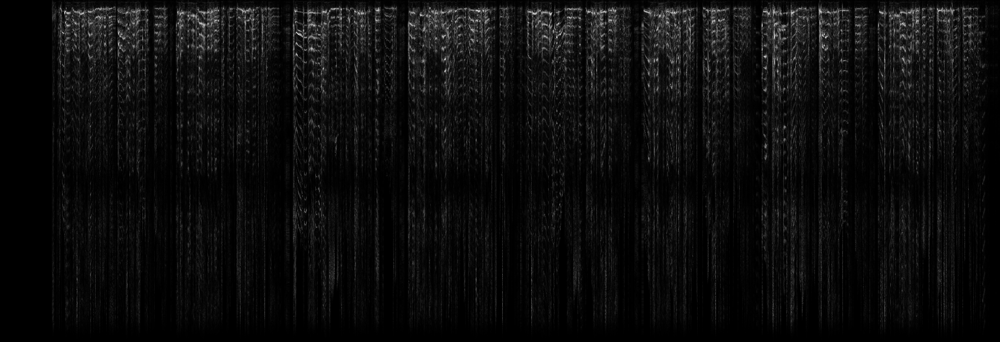
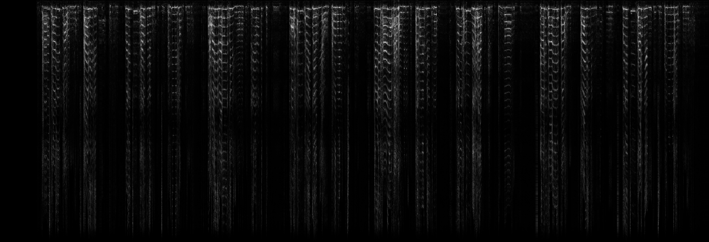
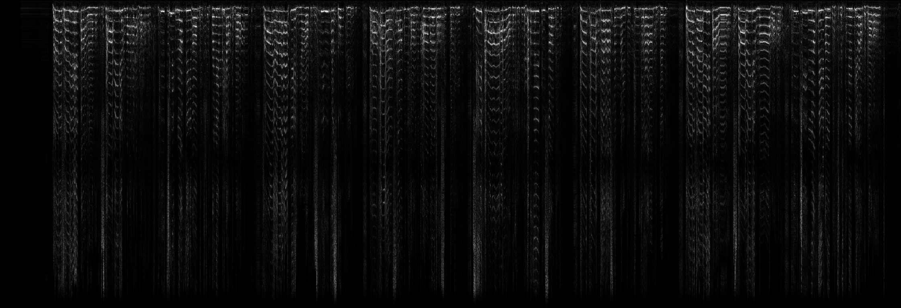

# Progress Log

This documents our progress towards Singing Style Transfer, as measured on one of our aligned benchmark examples.

For all of the examples below, Our target output is this:

[Audio](progress/perfect/reference_stylized.mp3)

And the source content is this:

[Audio](code/sample/rolling_in_the_deep/content.mp3)

## Week 7

> Post-processing network results go here!

## Week 6

We have a functioning 1D-PatchMatch baseline using both spectrogram and DeepSpeech features. DeepSpeech features result in a noisier output, but the results are approaching the range of output that can be fixed with post-processing. Using spectrogram features results in a cleaner output that is less stylistically correct.

**Neural Features:**

[Audio](progress/current_with_neural_features_patches/stylized.png/stylized.mp3)

**Spectral Features:**

[Audio](progress/current_with_spectral_features_patches/stylized.mp3)

**Perfect Features:**

(This is the result if we magically selected the optimum style patch for each input patch. It represents an upper bound on the quality of the stylized audio using a patch-cloning approach without post-processing)

[Audio](progress/perfect_feature_matching_patches/stylized.mp3)