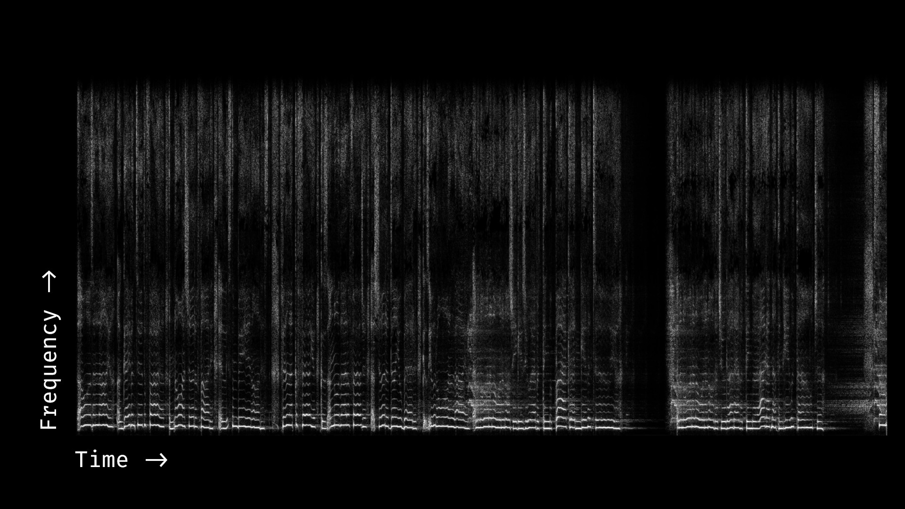
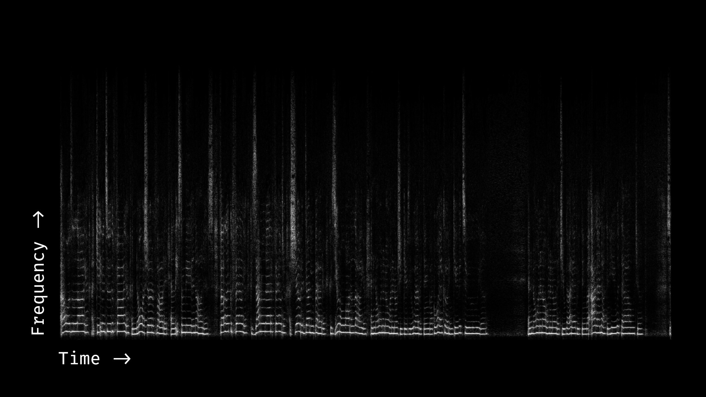
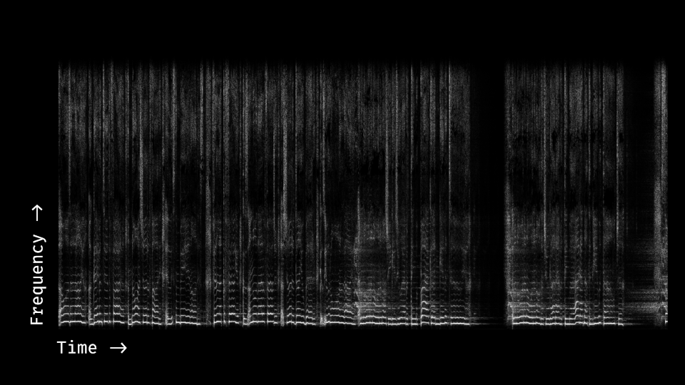
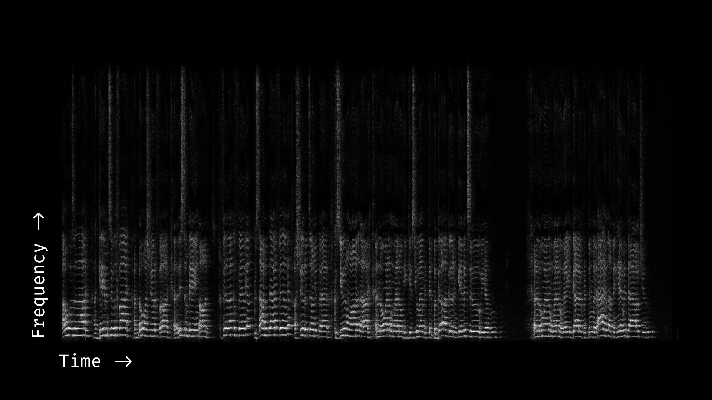
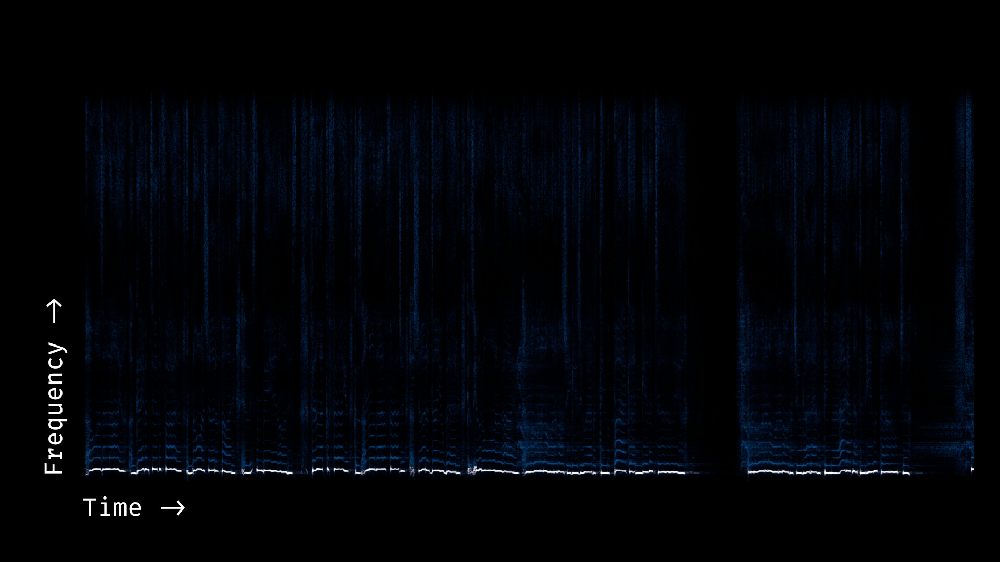
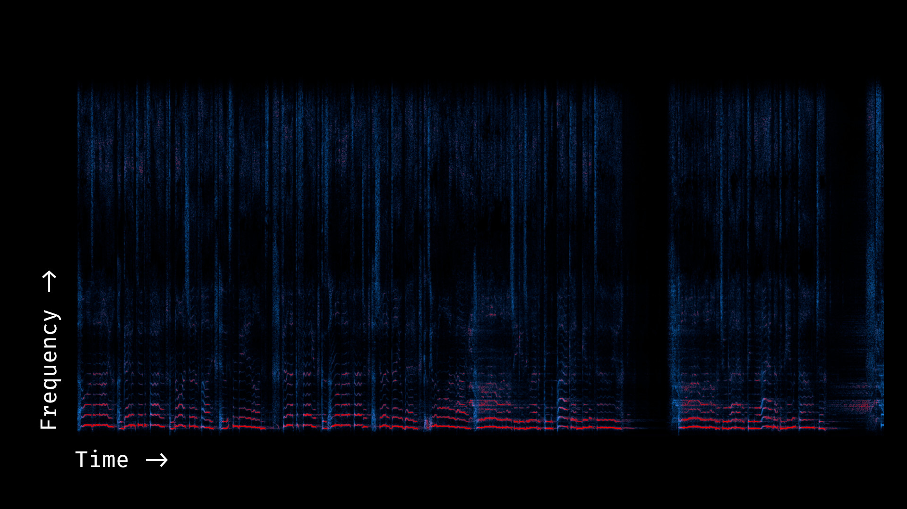
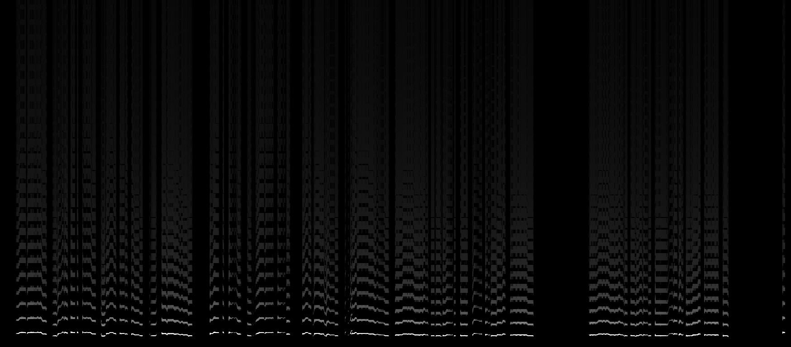

# Tasks

- [ ] Take notes on stylistic differences between Rolling in the Deep acapellas (in `data/aligned/rolling_in_the_deep`) to see if we're missing any elements of style

- [ ] Take notes on stylistic differences between Young and Beautiful acapellas (in `data/aligned/young_and_beautiful`) to see if we're missing any elements of style

- [ ] Implement super-resolution (recovery of high-frequency detail)

    - [ ] Implement fundamental frequency detection (rule-based or learned)
    - [ ] Implement harmonic super-resolution (duplicating the fundamental curve up to higher octaves... this may be doable with some fancy fourier transform magic - using a saw wave instead of a sin wave somehow - but we can also just do it graphically).
    - [ ] Implement sibilant detection / super-resolution if necessary
    - [ ] Build this into the global spectral envelope matching part of the pipeline.

    - [ ] While we're improving spectral envelope matching, we should probably be using a maximum filter when blurring instead of a gaussian, to represent "this is the loudest that x frequency range should be" rather than "this is the average loudness x frequency range should have", and filling in missing information with the super-resolved version.

- [ ] Test out neural-network image-to-image approaches (e.g. the fast photo style transfer thing) so that we have some baseline of what results modern end-to-end systems yield

    - [ ] https://github.com/NVIDIA/FastPhotoStyle
    - [ ] https://github.com/msracver/Deep-Image-Analogy

# Questions

Things we should probably answer to understand the problem better

- [ ] What does the phase look like in a spectrogram? Is it easy-to-predict, or is it random?

# Elements of Style

Things noticed while comparing aligned spectrograms. A successful style transfer algorithm should probably transfer most of these.

- [ ] High frequency detail is different (for different styles, there may be a lot of high-frequency information present, or it may be lost; we should recover it)
- [ ] Global spectral envelopes are different (for different styles, different frequency ranges will, on average, be brighter or darker; we should match it)
- [ ] Amplitude of speech components are different (for different styles, sibilants/vowels/breathing will have different relative loudness; we should match them)
- [ ] Low-level details are different (for different styles, reverb and vibrato will be more or less present)

# Singing Style Transfer

## The Task

The goal of this project is to develop a plausible algorithm for style transfer on audio files containing monophonic singing ("acapellas").

This is analogous to the (well-covered) field of image style transfer. The algorithm should take in a *style* file from the target singer and a *content* file which should be sung in the target's style.

Efforts to implement audio style transfer (and singing style transfer, specifically) have thus far been unsuccessful or moderately successful. The primary qualitative criteria for judging the output are:

- **Intelligibility:** are the non-stylistic features of the content audio (pitch, timing, vowel / consonant sounds) preserved?
- **Plausibility:** is the output file plausibly produced by the target singer (i.e. are the stylistic features transferred)?

Existing efforts usually perform poorly along one or both of these axes.

One potential obstacle to success in this task is an insufficiently clear definition of *how style arises* in singing audio. If we don't have a meaningful notion of style, then an algorithm that perfectly captures this non-meaningful notion will still produce output that fail our judging criteria.

So, let's look at some examples and try to figure out where the style is coming from.

## Spectrogram Examples

Audio is time-varying pressure (a single, highly self-similar amplitude that varies with time). Spectrograms are the result of performing a Fourier transform on that signal, and represent the amplitude and phase of a range of frequencies within the audio. We will ignore the phase (for now) and just show amplitude.

The following is the first few seconds of an amplitude spectrogram for the first 30 seconds of the isolated vocal (acapella) for Ariana Grande's "One Last Time":

You can reproduce this figure with `python code/conversion.py examples/one_last_time_original_30s.mp3` (though the *y* axis will be flipped). You can also open the mp3 in the [Audacity spectrogram view](https://manual.audacityteam.org/man/spectrogram_view.html) for an interactive spectrogram.

Some things to note:

* The audio is a mixture of sibilants (vertical lines, corresponding to sounds like the "s" in "was" or the "c" in "because") and vowel sounds (horizontal stacks of lines, corresponding to sounds like the "a" in "gave").
* The harmonics of each vowel sound are linearly spaced by the fundamental (lower-most) frequency, and follow the same pitch contour as the fundamental.
* Each sound (vowel or sibilant) has its own distribution of frequencies; the distribution of harmonics/overtones shifts for different sounds (e.g. different vowels)
* The vocal is heavily processed–there is smearing (reverb) and there are occasionally backing sounds (e.g. shouts).

It's worthwhile to listen through the vocal a view times (possible slowed [down](https://sound.stackexchange.com/questions/38322/how-do-i-change-the-playback-speed-without-changing-the-tempo)) to convince yourself that the sound you hear and the spectrogram are representing the same information.

Now, to understand which parts of the track are "style" and which parts are "content", we can see a different (less professional) singer sing the same content (I've pulled this from YouTube; you can/should download audio using [youtube-dl](https://rg3.github.io/youtube-dl/)).

(Note that I've aligned, pitch-corrected, and applied a dynamics compressor here to make the songs more comparable, so some of the basic "style" is already transferred).

You can reproduce this figure with `python code/conversion.py examples/one_last_time_cover_aligned_30s.mp3` (though the *y* axis will be flipped). The original audio is at `one_last_time_cover_30s.mp3`.

Here's a gif comparison (you can also open each image in a separate tab and flip between them):

Some notes:

- The cover is missing a lot of high frequency detail. This is probably the result of a low-quality mic (and, to some extent, YouTube compression).
- The cover is also weighting harmonics differently. Some harmonics that are present in the original are lost in the cover, and others are emphasized more.
- The cover is missing reverb but has occasional room noise.
- The relative amplitude of different parts of the audio is different. For example, intakes of breath are super loud in the original audio but almost inaudible in the cover.
- Although the melodies are the same, the precise vocalization is different. For example, there are parts where the original vocal has vibrato (wavering pitch) but the cover does not.

A perfect style transfer approach would correct all of these. In practice, we may only be able to fix some of them.

Here's another example (aligned, from a male vocalist):

Notes:

- This one is three semitones down (the vocalist is singing in a lower key), but this isn't an important stylistic component
- This audio includes room reverb (smudging) that is different from the other two examples.
- The frequency weighting is, again, different

## Planned Approach

The majority of techniques attempted so far (see the project proposal) use a single-stage, end-to-end pipeline. Although we can try this, I think it's more interesting to decompose the problem and try to get incremental results that are all intelligible (since they perform minor modifications) and plausible along some axis (e.g. they transfer some aspect of the style), along with (possibly) some end-to-end *post-processing* stage that attempts to reduce artifacts in the final audio file. If (by some miracle) we can build a successful decomposed pipeline, it's potentially possible to turn this into an end-to-end solution by building a big neural net with lots of auxiliary losses.

I've listed some possible components below:

#### Preprocessing:

- Pitch envelope extraction (we can use a pre-trained network like https://github.com/marl/crepe), e.g.:
    
- Sibilant vs. vowel segmentation (we can do this  manually given the pitch envelope by just masking everything to harmonics of the pitch), e.g.:
    
- Creating a "super-resolution" version of the content's vowel sounds (this can be done by taking the pitch envelope for the fundamental and duplicating/warping it into the higher octaves, as if the singer was a perfect saw wave); note that this example is just a mockup (it does nearest-neighbor scaling); an actual implementation should probably do curve fitting + antialiased drawing to get sharp, smoothly-transitioning higher harmonics
    
- Creating a "super-resolution" version of the content's sibilant sounds (this can be done by extending/stretching the higher frequencies upwards and taking a maximum with the original sibilant sounds)

### Processing:

- Global EQ matching (this may require layering in the super-resolved versions if the original signal is too quiet)
- Some sort of loudness/dynamics matching over time (conditioned on their frequency distribution). I'm not sure how to actually do this one in a reasonable way yet without some sort of ugly nearest neighbor lookup...
- local patch matching (using e.g. patchmatch or some form neural style transfer) to match small details in the spectrogram like vibrato and reverb. This should maybe actually be the first step 

### Post-processing

- Using amplitude-only spectrograms is a bad idea due to the resulting artifacts, we should figure out how to preserve phase or generate it using a postprocessing network.